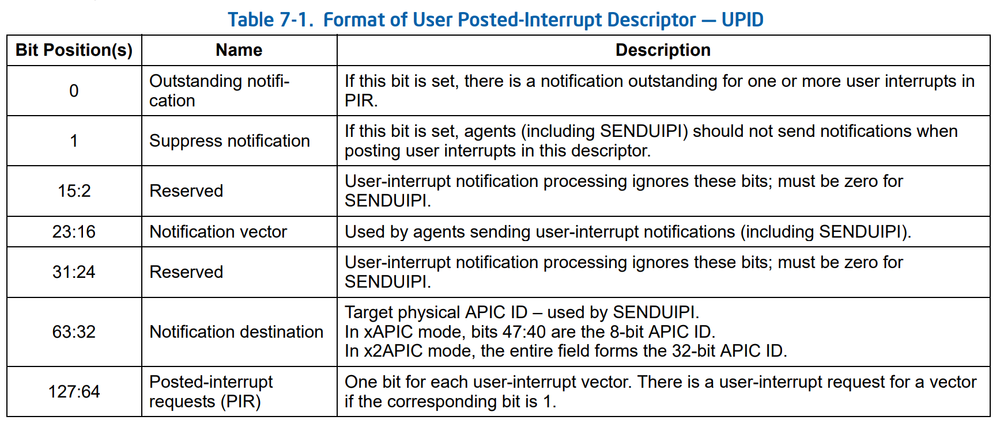

# Stage 2023

## links

Global :

<https://dept-info.labri.fr/~denis/Enseignement/Sujet_PFE_2023_uintr.html>
<https://inria.webex.com/meet/alexandre.denis>
<https://doc-si.inria.fr/>
<https://password.inria.fr/>
<https://mattermost.inria.fr/tadaam/channels/town-square>

User interruption :

<https://github.com/intel/uintr-compiler-guide/blob/uintr-gcc-11.1/UINTR-compiler-guide.pdf>
<https://github.com/intel/uintr-ipc-bench/tree/master/source/uintrfd>
<https://github.com/intel/uintr-ipc-bench/blob/master/source/uintrfd/uintrfd-bi.c>
<https://github.com/intel/uintr-ipc-bench/blob/master/source/uintrfd/uintrfd-uni.c>
<https://www.intel.com/content/www/us/en/developer/articles/technical/intel-sdm.html#combined>
<https://github.com/intel/uintr-linux-kernel/tree/uintr-next/tools/uintr/manpages>

BXI :


## TODO

-- le serveur Gitlab Inria : gitlab.inria.fr
Il faudra que tu demandes à rejoindre le projet
<https://gitlab.inria.fr/pm2/pm2>

-- demander l'accée aux daltones à brice (présisé que je suis le stagiaire de alexandre DENIS)

## notes User interruption

`IPC` : Inter-Process Communication.

`SENDUIPI` : SEND User Inner Process Interruption.

`uintr` for User INTeRuption.

> UINTR Connection management.

`UPID` : User Posted Interrupt Descriptor.


`UITT` : User Interrupt Target Table. (own two fields **UPID pointer** and **vector information**).

`UITT index` : index that refer to an `UITT` ?

`flags: int` an interruption identifier.
`handler_func: ??` the function handler?.
`uintr_fd: int` the file descriptor for the ipc.
`vector: ??`
`uipi_handle: int?`

`UIF` : User-Interrupt Flag

`senduipi <uipi_handle>` – send a user IPI to a target task based on the UITT index.
`uiret` : Return from a User Interrupt handler.
`clui` : Mask user interrupts by clearing UIF (User Interrupt Flag).
`stui` : Unmask user interrupts by setting UIF.
`testui` : Test current value of UIF.

### Receiver APIs

Allow to receive interruptions.

```c
int uintr_register_handler(handler_func, flags);
int uintr_unregister_handler(flags);
```

Link file descriptor to interruption flag.

```c
// Create an fd representing the vector - priority ??
uintr_fd = uintr_create_fd(vector, flags); // NOTE: type ??
```

I case we interact with the kernel.

```c
//Post user interruption from the kernel.
int uintr_notify(int uintr_fd);
```

### Sender APIs

// TODO: test if the flags is the same then receiver.

// use the file descriptor link to an receiver to send an interruption.

```c
// Receive FD via inheritance or UNIX domain sockets
uipi_handle = uintr_register_sender(uintr_fd, flags);
int uintr_unregister_sender(uintr_fd, flags);
```

Send an interruption

```c
void _senduipi(uipi_handle); // uipi_handle is UITT index.
```

### Env

> Kernel: Linux v5.14.0 + User IPI patches.

`-muintr` Compiler flag to allow `uintr`.

## notes BXI

`BXI` : Bull eXascale Interconnect

Bull, Atos..

- base on `Portals 4` to do message passing.
- [`Portals 4`](https://github.com/Portals4/portals4)
- support `MPI` (Message Passing Interface) and `PGAS` (Partitioned Global Address Space) new parallel programming languages.
  - send/receive
  - `RDMA` (Remote `DMA`) (Direct Memory Access).
- `SHMEM` : is a shared memory library from Cray (communication lib).
- `NIC` : Network Interface Card (a network card xD).
- `LME` List Management Engine.

`ASIC switch` (or `BXI switch`)
`ASIC NCI` (or `BXI NCI`)

Transmit Logic (TX).
Receive logic (RX).

`ASIP` (Application Specific Instruction set Processor).

<https://en.wikipedia.org/wiki/SerDes>

Put, Get and ME_Append.

## NewMadeleine

`NewMadeleine` is an rewrite of `Madeleine`.
Is a message communication library. `NewMadeleine` send message is mixed order.

`Mad-MPI` is an `NewMadeleine` *API adapter* for MPI.

`pioman` a framework used by MPI implementations to transparently made the communication progression asynchronous.
