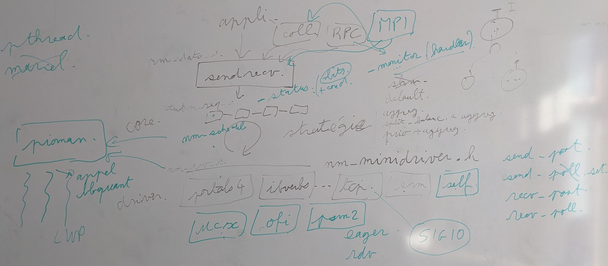

# Stage 2023

## links

Global :

- <https://dept-info.labri.fr/~denis/Enseignement/Sujet_PFE_2023_uintr.html>
- <https://inria.webex.com/meet/alexandre.denis>
- <https://inria.webex.com/meet/charles.goedefroit>
  > Préférences > Audio et vidéo > PIN de l'organisateur
- <https://doc-si.inria.fr/>
- <https://password.inria.fr/>
- <https://mattermost.inria.fr/tadaam/channels/town-square>

User interruption :

- <https://github.com/intel/uintr-compiler-guide/blob/uintr-gcc-11.1/UINTR-compiler-guide.pdf>
- <https://github.com/intel/uintr-ipc-bench/tree/master/source/uintrfd>
- <https://github.com/intel/uintr-ipc-bench/blob/master/source/uintrfd/uintrfd-bi.c>
- <https://github.com/intel/uintr-ipc-bench/blob/master/source/uintrfd/uintrfd-uni.c>
- <https://www.intel.com/content/www/us/en/developer/articles/technical/intel-sdm.html#combined>
- <https://github.com/intel/uintr-linux-kernel/tree/uintr-next/tools/uintr/manpages>

BXI :

- <https://www.sandia.gov/portals/portals-4-0-specification-clone-2/>

NewMadeleine :

- <https://gitlab.inria.fr/pm2/pm2>
- <https://pm2.gitlabpages.inria.fr/pm2/nmad/doc/>
- <https://theses.hal.science/tel-00469488>

> `pdftotext these_trahay.pdf` pour avoir le text avec les accents.

Examples :

- <https://hal.inria.fr/hal-01587584>

Dalton :

- <https://gitlab.inria.fr/runtime/internal/-/wikis/dalton/reserve>
- <https://gitlab.inria.fr/runtime/internal/-/wikis/dalton/dalton>

Signals :

- <https://man7.org/linux/man-pages/man2/sigaction.2.html>

## salle

Pour réservé une salle il faut ajouté un événement dans le calendrier Zimbra et faire `envoyer` (et non enregistré).

## ssh

`ssh acces.bordeaux.inria.fr`

`ssh cgoedefr@dalton.bordeaux.inria.fr`
On daltons `billy0` and `billy1` have BXI and infiniband NICs.

## git branch

- `nmad-uintr` : all
- `nmad-uintr-shm-sig` : shm driver with signal handler

## TODO

- faire une présentation des uinter
- check if task is thread (get citation)
- rpm source kernel
- see RedHat kernel
- add sig alt stack (test if pthread_self work in the alt stack).
- add fix for lock and multi thread (try_lock)
- refactor handler code
- v2 we juste dequeue(pw) to stop recv_poll
- lire la specs `portals 4` pour en discuté
- for `sig_shm` we consider one context by process and one connection by dest process (dest->pid).
- ...

## notes User interruption

### Definitions

| name       | description                                                                                |
| ---------- | ------------------------------------------------------------------------------------------ |
| `IPC`      | Inter-Process Communication                                                                |
| `uintr`    | User-INTeRupt                                                                              |
| `SENDUIPI` | SEND User Inner Process Interruption                                                       |
| `UIPI`     | User Inner Process Interruption                                                            |
| `UIF`      | User-Interrupt Flag. To enable or disable                                                  |
| `UITT`     | User-Interrupt Target Table. (own two fields **UPID pointer** and **vector information**). |
| `UPID`     | User Posted Interrupt Descriptor                                                           |

### notes TODO:

<!-- `ipi_fd` -->

 // TODO:
> UINTR Connection management.

- `RFLAGS` // TODO:
- `ring-3` // TODO:
- `stack frame` // TODO:

- One UIF store by thread (store in process or thread memory?). Allow to enable/disable uintr.
- Foreach thread with registered handle its own an unique vector space of 64 vectors (vector type is u64 and is a number).
- "The thread can then use uintr_vector_fd(2) to register a vector and create a user interrupt file descriptor - `uvec_fd`."
- One create uvec_fd for each 64 vectors in vectors space.
- The uvec_fd must be shared with potential senders. The uvec_fd allows a sender to generate an interrupt with the associated vector.
- When sender and receiver is in the same process we use `uintr_register_self()` and we don't need any `uvec_fd`.
- When the sender task register with the kernel `uintr_register_sender()`, the kernel  would  setup the routing tables (UITT) to connect the sender and receiver. The syscall return the uipi_index, this index is used by _senduipi(uipi_index).
- The sender process can share it's IPI connections with another process `uintr_ipi_fd()`.
- When the receiver task is running (in `ring-3`) then interruption is directly delivered.
- When the receiver task is not actively running we have different behavior :
  1. Thread sleep because another thread running. Uintr delivered when thread switch back. "The receiver has been context switched out because it's time slice has expired or a higher priority task is running. The a pending User Interrupt in that case would be delivered when the receiver is context switched back."
  2. "The receiver is in context but not running in `ring-3` (probably due to a syscall). The interrupt will be delivered the task enters `ring-3` again."
  3. Thread in blocked syscall. Possible to wait before delivery or use specific interrupt handler flags to just force delivery. "The receiver is blocked in the kernel and context switched out due to a blocking system call like read() or sleep(). The receiver can choose to be context switched in and the blocking syscall to be interrupted with the -EINTR error code similar to signal(). A specific interrupt handler flag needs to be passed to request such behavior."
- "The vector number pushed onto the stack to identify the source of the interrupt."
- The sender and the receiver need to close all fd and unregister uintr (`uintr_unregister_sender()`, `uintr_unregister_handler()`).

- `uintr_notify` is function to send uintr from kernel to user. (can be connect to NIC driver to allow uintr through the network /!\ not bypass kernel).

### instructions

Intrinsics (`x86gprintrin.h`) (x86 gpr intr in):
<!-- source:  form Intel slide [User Interrupt COMPILER GUIDE](img/UINTR-compiler-guide.pdf) and [Intel® 64 and IA-32 Architectures Software Developer’s Manual](biblio/325462-sdm-vol-1-2abcd-3abcd.pdf) "Intel Software Developers Manual" -->
| Instruction    | Intrinsic               | Meaning                                                  | description                                                |
| -------------- | ----------------------- | -------------------------------------------------------- | ---------------------------------------------------------- |
| `clui`         | _clui(void): void       | **CL**ear **U**ser **I**nterrupt                         | Mask user interrupts by clearing UIF                       |
| `stui`         | _stui(void): void       | **S**e**T** **U**ser **I**nterrupt                       | Unmask user interrupts by setting UIF                      |
| `testui`       | UIF ← _testui(void): u8 | **TEST** **U**ser **I**nterrupt                          | Get current value of UIF                                   |
| `senduipi r64` | _senduipi(u64): void    | **SEND** **U**ser **I**nner **P**rocess **I**nterruption | send a UIPI to a target task (thread) using the UITT index |
| `uiret`        |                         | **U**ser **I**nterrupt **RET**urn                        | Must be call at end of User-Interrupt handler              |
<!-- test if interruption is send after unlock _stui -->

### Syscall

<!-- source: <https://github.com/intel/uintr-linux-kernel/blob/uintr-next/arch/x86/entry/syscalls/syscall_64.tbl> and  <https://github.com/intel/uintr-linux-kernel/blob/uintr-next/include/linux/syscalls.h> -->
| Syscall                                                             | Description        |
| ------------------------------------------------------------------- | ------------------ |
| status     ← syscall(471, handler: void*, flags: u32):          s64 | register handler   |
| status     ← syscall(472, flags: u32):                          s64 | unregister handler |
| uvec_fd    ← syscall(473, vector: u64, flags: u32):             s64 | *create* vector fd |
| uipi_index ← syscall(474, uvec_fd: s32, flags: u32):            s64 | register sender    |
| status     ← syscall(475, uvec_fd: s32, flags: u32):            s64 | unregister sender  |
| status?    ← syscall(476, usec: u64, flags: u32):               s64 | wait               |
| status?    ← syscall(477, vector: u64, flags: u32):             s64 | register self      |
| status?    ← syscall(478, sp: void*, size: size_t, flags: u32): s64 | alt stack          |
| fd         ← syscall(479, flags: u32):                          s64 | ipi fd             |

// TODO: check syscall return status

#### In kernel

- `arch/x86/kernel/Makefile`
- `arch/x86/include/asm/uintr.h`
- `arch/x86/kernel/uintr.c`

Syscalls:

- `arch/x86/entry/syscalls/syscall_64.tbl`
- `include/linux/syscalls.h`

Tests:

- `tools/testing/selftests/x86/uintr.c`
- `tools/testing/selftests/uintr`

### Capabilities
<!-- source: Intel slide [User Interrupt COMPILER GUIDE](img/UINTR-compiler-guide.pdf) and ... -->
- Allow to deliver interrupt to interrupt handler in user space.
- If the task is sleep the interruption will be deliver when it's wake up.
- UINTR handler has multiple calling convention :
  1. The stack frame is defined by the hardware.
  2. All register must be preserved. (All registers are saved by the compiler).
  3. To return from UINTR handler we need to call the `uiret` instruction.
- One uintr handler by thread and not by process TODO: test <!-- source: "Only  one interrupt  handler  can  be  registered by a particular thread within a process."https://raw.githubusercontent.com/intel/uintr-linux-kernel/uintr-next/tools/uintr/manpages/0_overview.txt -->

### Env

> Kernel: Linux v5.14.0 + User IPI patches.

To now if uintr is available we can check if the "uintr" string is in `/proc/cpuinfo` under the "flags" field.

### Compiler flags

- `-muintr` Enable `uintr` handlers and intrinsics.
- `-mgeneral-regs-only` "Generate code that uses only the integer registers" (to only save integer register).
- `-minline-all-stringops` "Inline memcpy, memmove, memset and memcmp to avoid vector register usage in library functions".

### Compiler attribute

| Attribute                                              | Description                                                                                                                                                                                                                                                                                   |
| ------------------------------------------------------ | --------------------------------------------------------------------------------------------------------------------------------------------------------------------------------------------------------------------------------------------------------------------------------------------- |
| `__attribute__((interrupt))`                           | Indicate that the specified function is a uintr handler. The compiler will restore all registers, except for the `RFLAGS` register which is restore by the `uiret` instruction (in hardware), and will add the `uiret` instruction at end of the function (instead of the `ret` instruction). |
| `__attribute__((target("general-regs-only")))`         | Same as compiler flags but only for this uintr handler.                                                                                                                                                                                                                                       |
| `__attribute__((target("inline-all-stringops")))`      | Same as compiler flags but only for this uintr handler.                                                                                                                                                                                                                                       |
| `__attribute__((target("no_caller_saved_registers")))` | Indicate the the compiler to save all registers in called function and not in the caller function (callee-saved). This attribute can be used for a function called from a uintr handler.                                                                                                      |

### Limitations

- To compile all uintr handles and all functions called by uintr handles we need the `-muintr` compilation flag.
- For function called by uintr handles we need to precise this compiler flags `-mgeneral-regs-only -minline-all-stringops`, or this attribut before each functions `__attribute__((target("general-regs-only", "inline-all-stringops")))`.
  > if we use compiler flags we need to separate function call by uintr in an dedicated file.
  Idk if the function tag with the attribut are also generate for the standard code. TODO: test it!
- We can't use `memcpy`, `memmove`, `memset` and `memcmp` because they won't preserve vector registers. TODO: check if we can use it with `-minline-all-stringops`.

### Example

Explain variables in example:

| var name       | type                                                               | description                                    |
| -------------- | ------------------------------------------------------------------ | ---------------------------------------------- |
| `uipi_index`   | `s32`                                                              | (`UITT index`) index of an entry in the `UITT` |
| `flags`        | `s32`                                                              | an interruption identifier                     |
| `handler_func` | `__attribute__ ((interrupt)) void fun(struct __uintr_frame*, u64)` | the handler function address                   |
| `uvec_fd`      | `s32`                                                              | the file descriptor for the ipc                |
| `vector`       | `u64`                                                              | ??   TODO: describe vector                     |

#### Receiver APIs

Handler.

```c
struct __uintr_frame { // TODO: understand uintr frame
  unsigned long long rip; // Register Instruction Pointer (AKA. Program Counter (PC)) of ??
  unsigned long long rflags; // Register FLAGS??
  unsigned long long rsp; // Register Stack Pointer of ??
};

__attribute__ ((interrupt))
void f (struct __uintr_frame *frame, unsigned long long uirrv) {}
```

Allow to receive interruptions.

```c
int uintr_register_handler(handler_func, flags);
int uintr_unregister_handler(flags);
```

Link file descriptor to interruption flag.

```c
// Create an fd representing the vector - priority ??
uvec_fd = uintr_create_fd(vector, flags); // NOTE: type ??
```

Enable interrupts

```c
_stui();
```

I case we interact with the kernel.

```c
//Post user interruption from the kernel.
int uintr_notify(int uvec_fd);
```

#### Sender APIs

// TODO: test if the flags is the same then receiver.

// use the file descriptor link to an receiver to send an interruption.

```c
// Receive FD via inheritance or UNIX domain sockets
uipi_index = uintr_register_sender(uvec_fd, flags);
int uintr_unregister_sender(uvec_fd, flags);
```

Send an interruption

```c
void _senduipi(uipi_index); // uipi_index is UITT index.
```

## notes BXI

`BXI` : Bull eXascale Interconnect

Bull, Atos..

2 networks (of 4):

1. management network : logs, monitoring, services, deployment... (TCP/IP)
2. interconnect Network : between compute nodes (com), between storage and compute node... (Portal4)

network bandwidth : ~100Gb ~15 GB
communication time : ~1ms
instruction time : ~1ns
10-100 messages by secondes

`Portal4` event : PTL_EQ_get, PTL_EQ_wait PTL_EQ_poll... (EQ is for Event Queue).

sandia `portal 4` (4.3) pdf with the specs.

- base on `Portals 4` to do message passing.
- [`Portals 4`](https://github.com/Portals4/portals4)
- support `MPI` (Message Passing Interface) and `PGAS` (Partitioned Global Address Space) new parallel programming languages.
  - send/receive
  - `RDMA` (Remote `DMA`) (Direct Memory Access).
- `SHMEM` : is a shared memory library from Cray (communication lib).
- `NIC` : Network Interface Card (a network card xD).
- `LME` List Management Engine.

`ASIC switch` (or `BXI switch`)
`ASIC NCI` (or `BXI NCI`)

Transmit Logic (TX).
Receive logic (RX).

`ASIP` (Application Specific Instruction set Processor).

<https://en.wikipedia.org/wiki/SerDes>

Put, Get and ME_Append.

## NewMadeleine

`NewMadeleine` is an rewrite of `Madeleine`.
Is a message communication library. `NewMadeleine` send message is mixed order.

`Mad-MPI` is an `NewMadeleine` *API adapter* for MPI.

`PIOMan` (Process I/O Manager) a framework used by MPI implementations to transparently made the communication progression asynchronous. I/O manager.

`Marcel` qui est un ordonnancer de threads au niveau utilisateur sur des VP (Virtual Processor) qui sont dans l'espace utilisateur et qui sont bind à un core physique.

Interfaces :

- sendrecv has monitor (nm_sr_monitor_s).
- `MPI` depend of sendrecv (sr) and coll (collective).
- `RPC` (Remote Procedure Calls) depend of sendrecv (sr).
- `RMA` (One-sided). put/get/fence.

To use an handler with `sendrecv` we use monitor (`nm_monitor_s`). `nm_sr_request_monitor` for request and `nm_sr_monitor` for any events. (`nm_sendrecv_interface.h`).
To use an handler with `RPC` we use `nm_rpc_handler` that use `sendrecv` monitor.
Event handler is define like this `void (nm_core_event_notifier_t)(nm_core_event_s event, void* ref)`. And event is a structure that contain: status, gate, tag, seq number of packets, length and request.

To emit an event we call `nm_core_status_event(core, event, pack)` with owr event. Ths function will enqueue the event if monitor is set. The handler will be call when the scheduler (`nm_schedule(core)`) call event dispatch function (`nm_core_events_dispatch(core)`).

In driver `context` is an instance for a NIC and `status` is an instance of an connexion.

## road map



### 1. Voire le fonctionnement interne de `NewMadeleine`, les events, les drivers…

### 2. Testes avec le driver `shm`

- Avec des signaux en premier. `nmad-uintr-shm-sig`
- Avec les interruptions en espace utilisateur.
- Faire attention à ce qui est possible de faire ou non dans les handlers. (exec flow).

### 3. Au niveau du driver `tcp` (SIGIO)

### 4. Portals 4
