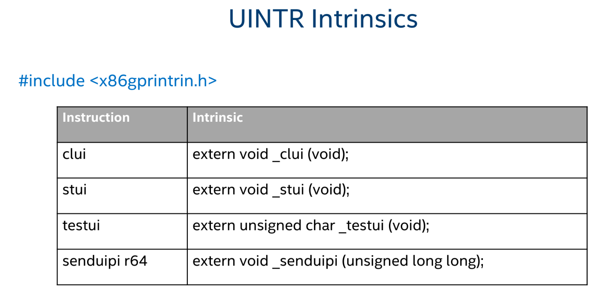
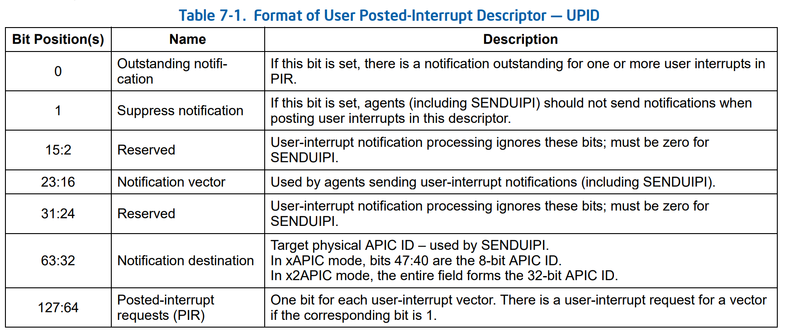

# User interruption notes

## Links

- [compile guide](https://github.com/intel/uintr-compiler-guide/blob/uintr-gcc-11.1/UINTR-compiler-guide.pdf)
- [uintr examples](https://github.com/intel/uintr-ipc-bench/tree/master/source/uintrfd)
- [uintr examples bi](https://github.com/intel/uintr-ipc-bench/blob/master/source/uintrfd/uintrfd-bi.c)
- [uintr examples uni](https://github.com/intel/uintr-ipc-bench/blob/master/source/uintrfd/uintrfd-uni.c)
- [intel programer manual](https://www.intel.com/content/www/us/en/developer/articles/technical/intel-sdm.html#combined)
- [uintr manuals](https://github.com/intel/uintr-linux-kernel/tree/uintr-next/tools/uintr/manpages)

## Definitions

| name              | description                                                        |
| ----------------- | ------------------------------------------------------------------ |
| `IPC`             | **I**nter-**P**rocess **C**ommunication                            |
| `uintr`           | **U**ser-**INT**e**R**upt                                          |
| `SENDUIPI`        | **SEND** **U**ser **I**nner **P**rocess **I**nterruption           |
| `UIPI`            | **U**ser **I**nner **P**rocess **I**nterruption                    |
| `UIF`             | **U**ser-**I**nterrupt **F**lag                                    |
| `UITT`            | **U**ser-**I**nterrupt **T**arget **T**able                        |
| `UPID`            | **U**ser **P**osted **I**nterrupt **D**escriptor                   |
| `GPR`             | **G**eneral-**P**urpose **R**egisters                              |
| `uipi_index: s32` | (`User IPI index` or `UITT index`) index of an entry in the `UITT` |

- `rflags` is for Register FLAGS. This register contains the following flags that represent the stats of the program:
  - CF (Carry flag)
  - PF (Parity flag)
  - ZF (Zero flag)
  - SF (Sign flag)
  - TF (Trap flag)
  - IF (Interrupt enable flag)
  - DF (Direction flag)
  - OF (Overflow flag)
  - ...
- `rip` is for Register Instruction Pointer (AKA. Program Counter (PC))
- `rsp` is for Register Stack Pointer

<!-- task is code execute by thread (One task <=> One thead)-->

- In `protected mode` the CPU can be in 4 privilege levels (or privilege rings), numbered from 0 to 3.
  1. `ring-0` the most privilege, for **kernel**. Access to all instructions...
  2. `ring-1` for **device drivers**. For I/O and device instructions...
  3. `ring-2` for **device drivers**. For I/O and device instructions...
  4. `ring-3` the least privilege, for **applications**. User instruction like operation, on scalar and vector...
- The `stack frame` is a section of the stack that correspond to an function call. That contain the return address, the argument parameters, the callee-saved copies of registers modified and the local variables.

## instructions

X86 GPR intrinsics (`x86gprintrin.h`):
<!-- source:  form Intel slide [User Interrupt COMPILER GUIDE](img/UINTR-compiler-guide.pdf) and [Intel® 64 and IA-32 Architectures Software Developer’s Manual](biblio/325462-sdm-vol-1-2abcd-3abcd.pdf) "Intel Software Developers Manual" -->
| Instruction    | Intrinsic               | Meaning                                                  | description                                                |
| -------------- | ----------------------- | -------------------------------------------------------- | ---------------------------------------------------------- |
| `clui`         | _clui(void): void       | **CL**ear **U**ser **I**nterrupt                         | Mask user interrupts by clearing UIF                       |
| `stui`         | _stui(void): void       | **S**e**T** **U**ser **I**nterrupt                       | Unmask user interrupts by setting UIF                      |
| `testui`       | UIF ← _testui(void): u8 | **TEST** **U**ser **I**nterrupt                          | Get current value of UIF                                   |
| `senduipi r64` | _senduipi(u64): void    | **SEND** **U**ser **I**nner **P**rocess **I**nterruption | send a UIPI to a target task (thread) using the UITT index |
| `uiret`        | _uiret(void): void      | **U**ser **I**nterrupt **RET**urn                        | Must be call at end of User-Interrupt handler              |

- Each thread has one **UIF** local flag (store in thread memory? or in register?). Allow to enable / disable UIPI.
- if a process uses `SENDUIPI` without registering using the syscall `uintr_register_sender` the process will receive a SIGILL (Illegal instruction) signal.
- If a process uses an illegal `uipi_index`, it receives a SIGSEGV signal.

## Syscall

<!-- source: <https://github.com/intel/uintr-linux-kernel/blob/uintr-next/arch/x86/entry/syscalls/syscall_64.tbl> and  <https://github.com/intel/uintr-linux-kernel/blob/uintr-next/include/linux/syscalls.h> -->
| Syscall                                                             | Function name            | task     |
| ------------------------------------------------------------------- | ------------------------ | -------- |
| status     ← syscall(471, handler: void*, flags: u32):          s64 | uintr_register_handler   | receiver | register handler   |
| status     ← syscall(472, flags: u32):                          s64 | uintr_unregister_handler | receiver | unregister handler |
| uvec_fd    ← syscall(473, vector: u64, flags: u32):             s64 | uintr_vector_fd          | receiver | *create* vector fd |
| uipi_index ← syscall(474, uvec_fd: s32, flags: u32):            s64 | uintr_register_sender    | sender   | register sender    |
| status     ← syscall(475, uvec_fd: s32, flags: u32):            s64 | uintr_unregister_sender  | sender   | unregister sender  |
| status     ← syscall(476, usec: u64, flags: u32):               s64 | uintr_wait               | receiver | wait               |
| uipi_index ← syscall(477, vector: u64, flags: u32):             s64 | uintr_register_self      | ?        | register self      |
| status     ← syscall(478, sp: void*, size: size_t, flags: u32): s64 | uintr_alt_stack          | receiver | alt stack          |
| ipi_fd     ← syscall(479, flags: u32):                          s64 | uintr_ipi_fd             | sender   | ipi fd             |

### Syscalls details

- `uintr_register_handler(handler, flags)`: use by a receiver thread to setup the given handler function as uintr handler.
  - This registration is not inherited across forks or additional threads are created.
  - Return the status `0` on success and `-1` on error (errno is set).
  - Flags used to change the blocking behavior:
    - UINTR_HANDLER_FLAG_WAITING_ANY       Enable the support for interrupting blocking system calls. Use any of the below mechanisms to enable support.
    - UINTR_HANDLER_FLAG_WAITING_RECEIVER  Enable the support for interrupting blocking system calls. The cost to wake up the blocking task is paid on the receiver side.
    - UINTR_HANDLER_FLAG_WAITING_SENDER    Enable the support for interrupting blocking system calls. The cost to wake up the blocking task is paid on the sender side.
    - UINTR_HANDLER_FLAG_WAITING_NONE      Do not enable interrupting blocking system calls. Set by default unless any of the above have been specified.
  - ERRORS (errno):
    - ENOSYS  Underlying hardware doesn't have support for Uintr.
    - EINVAL  flags is not valid.
    - EFAULT  handler address is not valid.
    - ENOMEM  The system is out of available memory.
    - EBUSY   An interrupt handler has already been registered.
- `uintr_unregister_handler(flags)`: use by a receiver thread to unregister the handler.
  - Vectors and `uvec_fd` allocated for this thread would be deactivated.
  - This syscall don't call close on `uvec_fd`.
  - Return the status `0` on success and `-1` on error (errno is set).
  - The flags is reserved for future use and must be set to 0.
  - ERRORS (errno):
    - ENOSYS  Underlying hardware doesn't have support for Uintr.
    - EINVAL  flags is not 0.
    - EINVAL  No registered user interrupt handler.
- `uintr_vector_fd(vector, flags)`: use by a receiver thread to get a file descriptor (uvec_fd) linked to one of its vectors. This registers the vector as used.
  - An uintr handler must be defined before call this syscall.
  - We can create one unique `uvec_fd` for each 64 vector in vectors space.
  - The `uvec_fd` must be shared with potential senders (other processes and the kernel) to allow them to send an UIPI.
  - Return a new `uvec_fd` file descriptor on success or `-1` on error (errno is set).
  - The flags is reserved for future use and must be set to 0.
  - ERRORS (errno):
    - ENOSYS  Underlying hardware doesn't have support for Uintr.
    - EINVAL  flags is not 0.
    - EFAULT  handler address is not valid. FIXME: an error on the manual? replace address by vector?
    - EMFILE  The per-process limit on the number of open file descriptors has been reached.
    - ENFILE  The system-wide limit on the total number of open files has been reached.
    - ENODEV  Could not mount (internal) anonymous inode device.
    - ENOMEM  The system is out of available memory to allocate uvec_fd.
    - ENOSPC  The requested vector is out of available range.
- `uintr_register_sender(uvec_fd, flags)`: use by a sender process to setup an entry in the routing table (UITT) and generate a new UIPI index (`uipi_index`).
  - `uipi_index` can be used by the instruction `SENDUIPI` (`_senduipi(uipi_index)`).
  - The routing tables (UITT) is setup in the kernel, is used to connect the sender and receiver.
  - In case of a multi-threaded process, the `uipi_index` is valid for all threads of the same process.
  - Return a new UIPI index (`uipi_index`) on success or `-1` on error (errno is set).
  - The flags is reserved for future use and must be set to 0.
  - ERRORS (errno):
    - ENOSYS      Underlying hardware doesn't have support for uintr.
    - EOPNOTSUPP  uvec_fd does not refer to a Uintr instance.
    - EBADF       The uvec_fd passed to the kernel is invalid.
    - EINVAL      flags is not 0.
    - EISCONN     A connection to this uvec_fd has already been established.
    - ECONNRESET  The user interrupt receiver has disabled the connection.
    - ESHUTDOWN   The user interrupt receiver has exited the connection.
    - ENOSPC      No uipi_index can be allocated. The system has run out of the available user IPI indexes.
    - ENOMEM      The system is out of available memory to register a user IPI sender.
- `uintr_unregister_sender(uvec_fd, flags)`: use by a sender thread to clear entry of UITT based on (`uipi_index` or `uvec_fd` bug ?).
  - "In case of multi-threaded process this will remove this connection from all the threads that share the same Target table".
  - Return the status `0` on success and `-1` on error (errno is set).
  - The flags is reserved for future use and must be set to 0.
  - ERRORS (errno):
    - ENOSYS  Underlying hardware doesn't have support for Uintr.
    - EINVAL  flags is not 0.
    - EINVAL  No connection has been setup for this uipi_index.
- `uintr_wait(usec, flags)`: use by a receiver thread to suspend for usec microseconds until a UIPI is delivered.
  - Return the status `0` on success and `-1` on error (errno is set).
  - The flags is reserved for future use and must be set to 0.
  - ERRORS (errno):
    - ENOSYS      Underlying hardware doesn't have support for Uintr.
    - EOPNOTSUPP  No interrupt handler registered.
    - EINVAL      flags is not 0.
    - EINVAL      usec is greater than 1e9 (1000 seconds).
    - EINTR       A user interrupt was received and the interrupt handler returned. (also set when status is 0).
- `uintr_register_self(vector, flags)`: use by a receiver for all threads (potential sender) in the same process.
  - The kernel create an entry in the UITT without any `uvec_fd`.
  - Return a new user `uipi_index` on success or `-1` on error (errno is set).
  - The flags is reserved for future use and must be set to 0.
  - ERRORS (errno):
    - ENOSYS      Underlying hardware doesn't have support for uintr.
    - EINVAL      flags is not 0.
    - ECONNRESET  The user interrupt receiver has disabled the connection.
    - ESHUTDOWN   The user interrupt receiver has exited the connection.
    - ENOSPC      No uipi_index can be allocated. The system has run out of the available user IPI indexes.
    - ENOMEM      The  system  is out of available memory to register a user IPI sender.
    - ENOSPC      The requested vector is out of available range.
- `uintr_alt_stack(*sp, size, flags)`: use by a receiver thread to define an alternate stack to uintr handler.
  - The `*sp` pointer must be allocate by the user with the same size as `size`.
  - If `*sp` is NULL the alternate stack will be clear (are also clear by uintr_unregister_handler).
  - Return the status `0` on success and `-1` on error (errno is set).
  - The flags is reserved for future use and must be set to 0.
  - ERRORS (errno):
    - ENOSYS      Underlying hardware doesn't have support for Uintr.
    - EOPNOTSUPP  No interrupt handler registered.
    - EINVAL      flags is not 0.
- `uintr_ipi_fd(flags)`: use by a sender to share its uintr connection with another process.
  - "uipi_fd that abstracts all the `uipi_index` based connections".
  - Return the file descriptor on success or `-1` on error (errno is set).
  - The flags is reserved for future use and must be set to 0.
  - ERRORS (errno):
    - ENOSYS  Underlying hardware doesn't have support for uintr.
    - EINVAL  flags is not 0.
    - EMFILE  The  per-process  limit  on  the  number  of  open  file descriptors has been reached.
    - ENFILE  The system-wide limit on the total number  of  open  files has been reached.
    - ENODEV  Could not mount (internal) anonymous inode device.
    - ENOMEM  The system is out of available memory to allocate uipi_fd.

### Syscall enum, handler and structure

The uintr handler definition has two argument a `frame` and `the vector`.

```c
__attribute__ ((interrupt))
void handler (struct __uintr_frame *frame, u64 vector) {}
```

The `__uintr_frame` is a structure with three fields. The structure represent... // TODO:

1. `u64 rip` is the instruction pointer of ?? TODO:
2. `u64 rflags` is the register flags of ?? TODO:
3. `u64 rsp` is the stack pointer of ?? TODO: (try to print `void* p = NULL; printf("%p", (void*)&p);`).

- The vector is a number us to identify the source of UIPI, is use like interruption events. The vector value is from 0 to 63 and is pushed onto the stack at UIPI invoked.

`UITT` (own two fields **UPID pointer** and **vector information**). // TODO: explain
`UPID`

### In kernel

- `arch/x86/kernel/Makefile`
- `arch/x86/include/asm/uintr.h`
- `arch/x86/kernel/uintr.c`

Syscalls:

- `arch/x86/entry/syscalls/syscall_64.tbl`
- `include/linux/syscalls.h`

Tests:

- `tools/testing/selftests/x86/uintr.c`
- `tools/testing/selftests/uintr`

## Capabilities
<!-- source: Intel slide [User Interrupt COMPILER GUIDE](img/UINTR-compiler-guide.pdf) and ... -->
- Allow to deliver interrupt to interrupt handler in user space.
- When the receiver task is running (in `ring-3`) then interruption is directly delivered.

- If the task is sleep the interruption will be deliver when it's wake up.

- When the receiver task is not actively running we have different behavior :
  1. The receiver thread is scheduled out, because it's time slice has expired or another thread with higher priority task running. UIPI will be delivered when thread switch back (scheduled again).
  2. The receiver thread is blocked in kernel (not in `ring-3`), probably due to a syscall (write...). UIPI will be delivered when thread will be back in user-space (in `ring-3`).
  3. The thread in interruptible syscall. Possible to wait before delivery or use specific interrupt handler flags to just force delivery. "The receiver is blocked in the kernel and context switched out due to a blocking system call like read() or sleep(). The receiver can choose to be context switched in and the blocking syscall to be interrupted with the -EINTR error code similar to signal(). A specific interrupt handler flag needs to be passed to request such behavior."
- One uintr handler by thread and not by process <!-- source: "Only  one interrupt  handler  can  be  registered by a particular thread within a process."https://raw.githubusercontent.com/intel/uintr-linux-kernel/uintr-next/tools/uintr/manpages/0_overview.txt -->
- Each thread with a registered handler own an unique vector space of 64 vectors. This vector is a u64 number form 0 to 63. 63 has the highest priority and 0 the lowest.
  <!-- source: 3_vector_fd.txt "Each thread has a private vector space of 64 vectors ranging from 0-63. Vector number 63 has the highest priority while vector number 0 has the lowest. If two or more interrupts are pending to be delivered then the interrupt with the higher vector number will be delivered first followed by the ones with lower vector numbers. Applications can choose appropriate vector numbers to prioritize certain interrupts over others." -->
- `uintr_notify` is a function to send UIPI from kernel to user. (can be connect to NIC driver to allow uintr through the network /!\ not kernel bypass).
- When UIPI is send during UIF is lock (_clui) we receive interruption after unlock (_stui) :
  - "the interrupt will be stored in memory and delivered when the receiver is able to receive it."

## Constrains / limitations

- If a sender send multiple UIPIs with the same vector while the receiver is not able to receive them then all would be coalesced.
  - Only a single UIPI per vector would be delivered.
- UINTR handler has multiple calling convention :
  1. The stack frame is defined by the hardware.
  2. All register must be preserved. (All registers are saved by the compiler).
  3. To return from UINTR handler we need to call the `uiret` instruction.
- To compile all uintr handlers and all functions called by uintr handlers we need the `-muintr` compilation flag.
- For function called by uintr handlers we need to precise this compiler flags `-mgeneral-regs-only -minline-all-stringops`, or this attribut before each functions `__attribute__((target("general-regs-only", "inline-all-stringops")))`.
  > if we use compiler flags we need to separate function call by uintr in an dedicated file.
  <!-- Idk if the function tag with the attribut are also generate for the standard code. TODO: test it! -->
- We can't use `memcpy`, `memmove`, `memset` and `memcmp` because they won't preserve vector registers. TODO: check if we can use it with `-minline-all-stringops`.
- A file descriptor need to be shared between receiver and sender. The receiver send fd via inheritance, `pidfd_getfd` or UNIX domain sockets.

## Best practices

- The sender and the receiver need to close all fd and unregister uintr (`uintr_unregister_sender()`, `uintr_unregister_handler()`).
- Put all uintr handlers and all function called by an uintr handlers in a separate file.

## Env

We need a CPU `Intel Xeon Sapphire Rapids`.

> Kernel: Linux v5.14.0 + User IPI patches.

To now if uintr is available we can check if the "uintr" string is in `/proc/cpuinfo` under the "flags" field.

Uintr support has added to GCC(11.1) and Binutils(2.36.1).

## Compiler flags

- `-muintr` Enable `uintr` handlers and intrinsics.
- `-mgeneral-regs-only` "Generate code that uses only the integer registers" (to only save integer register).
- `-minline-all-stringops` "Inline memcpy, memmove, memset and memcmp to avoid vector register usage in library functions".

## Compiler attribute

| Attribute                                              | Description                                                                                                                                                                                                                                                                                   |
| ------------------------------------------------------ | --------------------------------------------------------------------------------------------------------------------------------------------------------------------------------------------------------------------------------------------------------------------------------------------- |
| `__attribute__((interrupt))`                           | Indicate that the specified function is a uintr handler. The compiler will restore all registers, except for the `RFLAGS` register which is restore by the `uiret` instruction (in hardware), and will add the `uiret` instruction at end of the function (instead of the `ret` instruction). |
| `__attribute__((target("general-regs-only")))`         | Same as compiler flags but only for this uintr handler.                                                                                                                                                                                                                                       |
| `__attribute__((target("inline-all-stringops")))`      | Same as compiler flags but only for this uintr handler.                                                                                                                                                                                                                                       |
| `__attribute__((target("no_caller_saved_registers")))` | Indicate the the compiler to save all registers in called function and not in the caller function (callee-saved). This attribute can be used for a function called from a uintr handler.                                                                                                      |

## TODO

- test where UIF is store (in thread memory? or in register?)
- `__uintr_frame` represent the current handler call or the interrupted flow?
- rsp is change by the compiler? or by the cpu? / vector number pushed by the compiler? or by the cpu?
- UITT
- UPID 

- issus for `long sys_uintr_unregister_sender(int uvec_fd, unsigned int flags);`. `uvec_fd` will be name `uipi_index`.
- FIXME: an error on the manual? replace address by vector?

Vector material representation :

|     | number |
| --- | ------ |
|     | 6 bits |
